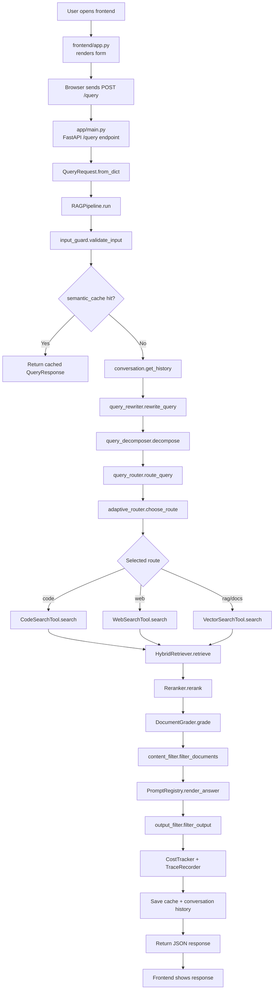

# Request Flow

This document explains how a query moves from the frontend to the backend and
through the demo RAG pipeline.

## Mermaid Diagram

## Step By Step

1. The frontend in `frontend/app.py` renders a small form and sends the query to
   `POST /query`.
2. FastAPI in `app/main.py` parses the incoming JSON into `QueryRequest`.
3. `RAGPipeline.run()` validates the input and checks whether the same query is
   already cached.
4. If there is no cache hit, the pipeline loads session history and rewrites the
   query when it looks like a follow-up question.
5. The router picks a route such as `code`, `web`, `docs`, or fallback `rag`.
6. A route-specific search tool returns candidate documents.
7. The hybrid retriever scores documents, and the reranker boosts stronger
   matches.
8. The document grader and content filter remove weak or unsafe results.
9. The prompt registry formats a response from the route and selected documents.
10. The output filter redacts blocked phrases, and observability helpers append
    trace and cost metadata.
11. The response is cached, conversation history is updated, and JSON is
    returned to the frontend.

## Main Files

- `frontend/app.py`
- `app/main.py`
- `app/services/rag_pipeline.py`
- `app/services/query_router.py`
- `app/services/query_rewriter.py`
- `app/services/semantic_cache.py`
- `app/components/hybrid_retriever.py`
- `app/components/reranker.py`
- `agents/adaptive_router.py`
- `agents/tools/code_search.py`
- `agents/tools/web_search.py`
- `agents/tools/vector_search.py`
- `security/input_guard.py`
- `security/content_filter.py`
- `security/output_filter.py`
- `prompts/registry.py`
- `observability/tracer.py`
- `observability/cost_tracker.py`

## Notes

- This demo uses deterministic local data instead of real LLM calls or live
  web search.
- The structure is meant to show where production components would plug in
  later without changing the overall request flow.
