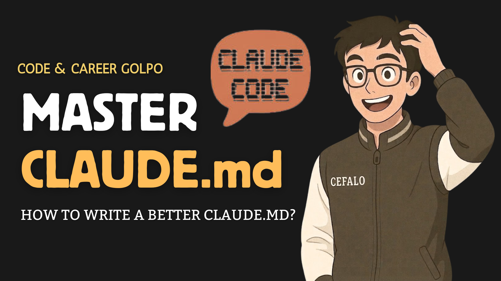

# 🤖 About

> A personal repository and handbook of experiments, learnings, and documentation dedicated to mastering Claude Code.

<figure><figcaption></figcaption></figure>

### 👋 About Me

Hello! I am Sumanta Saha Mridul, an Associate Software Engineer at Cefalo.

### 🎯 Purpose of this Gitbook

In this Gitbook, I will be trying out different features, concepts, and workflows related to Claude Code. I go through many excellent documents and resources about Claude on a daily basis. To keep track of it all, I am compiling this space to add as much documentation and as many hands-on, learning-related experiments as possible.

Essentially, this is a complete handbook I am building for myself to structure my learning journey.

### 🤝 Feel Free to Explore

While this is primarily a personal reference guide, you are more than welcome to read through it! If you find it helpful, feel free to follow along and use these resources for your own purposes.

#### What to Expect:

* Daily Learnings: Insights gathered from various high-quality documents.
* Practical Experiments: Hands-on examples and things you can try with Claude Code.
* Curated Documentation: A structured collection of learning materia

This is Sumanta Saha Mridul, an Associate Software Engineer in Cefalo. In this Gitbook I will try out different things related to Claude Code. I daily go through many good documents related to Claude so I will try to add as much documentation related to learning-related things that you can try with the Claude Code. There is a complete handbook I will just make for myself. If you like you can read it or follow it for your purpose.

### Jump right in


