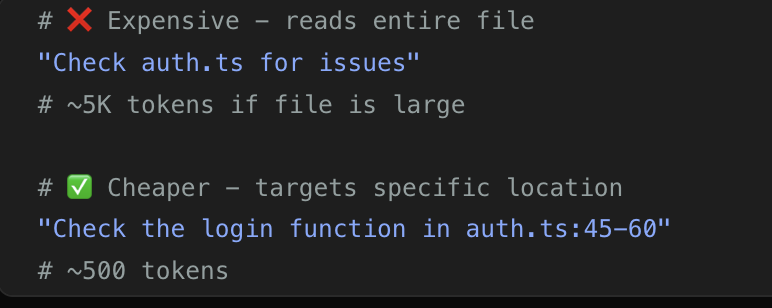

# Suggestions!

1. Use this prompt&#x20;


```
Summarizes everything from here that point forward, keeping earlier context intact
```


2. Use `esc` + `esc` to go a check point
3. Save large decisions&#x20;


```
Before ending a productive session:
"Save our authentication decision to memory:
- Chose JWT over sessions for scalability
- Token expiry: 15min access, 7d refresh
- Store refresh tokens in httpOnly cookies"

```


4. A interactiveway to work a feature chat&#x20;


```
tasks/
├── todo.md      # Current plan (checkable items)
└── lessons.md   # Rules accumulated from corrections
```



```
# === CHECKPOINT 1 ===

[... 500 lines of instructions ...]

# === CHECKPOINT 2 === 

[... 500 lines of instructions ...]

# === CHECKPOINT 3 === 
```



```
## Current Focus
[Single atomic task with clear deliverable]

## Acceptance Criteria
- [ ] Tests pass
- [ ] Build succeeds
- [ ] [Specific verification]

## Context
- Related files: [paths]
- Constraints: [rules]

## Do NOT
- Start other tasks
- Refactor unrelated code
```


You: "Create a session handoff document for what we accomplished today"


```
# Session Handoff - [Date] [Time]

## What Was Accomplished
- [Key task 1 completed]
- [Key task 2 completed]
- [Files modified: list]

## Current State
- [What's working]
- [What's partially done]
- [Known issues or blockers]

## Decisions Made
- [Architectural choice 1: why]
- [Technology selection: rationale]
- [Trade-offs accepted]

## Next Steps
1. [Immediate next task]
2. [Dependent task]
3. [Follow-up validation]

## Context for Next Session
- Branch: [branch-name]
- Key files: [list 3-5 most relevant]
- Dependencies: [external factors]
```



5. Cost Optimization

<figure><figcaption></figcaption></figure>

6. Task Planner Agent :thumbsup:


```
---
name: planner
model: opus
tools: Read, Grep, Glob
---
# Strategic Planning Agent
```

